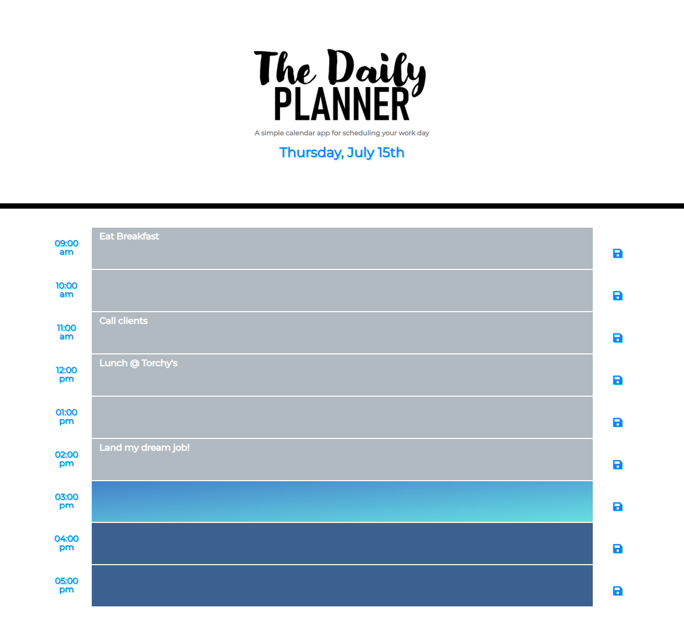

# Day-Planner

## What is the Day Planner project about?

We were tasked with creating a day planner where the user can write in tasks they need to complete for the current day.  The user can also store these tasks and have them reload into the page when navigating back to the planner.

## How did I do it?

1.  I created the planner to only show business hours that the client would need to utilize.
2.  I made the rows into a text area that you can put in whatever task needs to be completed.
3.  I then created a save button so that the user can keep their information stored into local storage and retrieve the same tasks on reload.
4.  The last thing that I created was a feature to run through the time blocks and show a different color for the past. present, and future hours.

## Example of the Day Planner

# Check out the Day Planner here!
